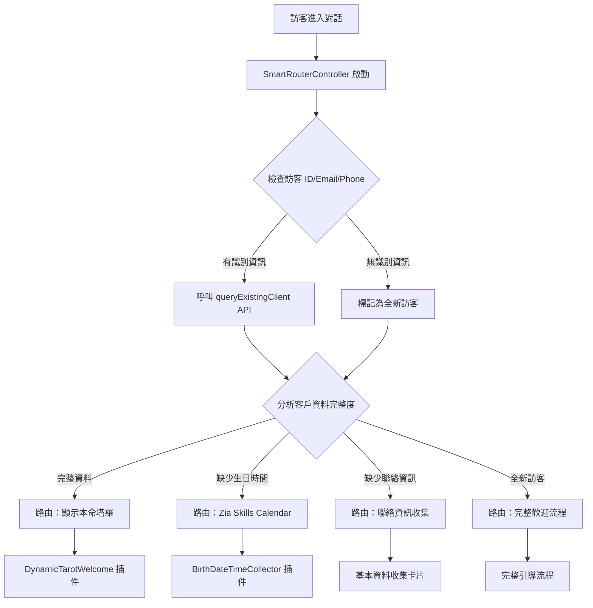

# SalesIQ 條件路由系統技術指南

## 🎯 系統概述

SalesIQ 條件路由系統透過智慧判斷訪客資料完整度，自動決定對話流程路徑，提供個人化的用戶體驗。

## 🔄 路由邏輯架構

### 核心組件

1. **SmartRouterController.deluge** - 智慧路由控制器插件
2. **DynamicTarotWelcome.deluge** - 動態塔羅歡迎插件  
3. **BirthDateTimeCollector.deluge** - Zia Skills 生日收集器
4. **queryExistingClient API** - 客戶資料查詢 API

### 路由決策流程



## 🎛️ 條件判斷規則

### 資料完整度檢查

| 資料類型 | 檢查欄位 | 路由動作 |
|---------|---------|----------|
| **完整客戶** | name, birth_date, birth_time, contact | 顯示本命塔羅 |
| **缺生日** | birth_date 或 birth_time 缺失 | Zia Skills Calendar |
| **缺聯絡** | email 和 phone 都缺失 | 聯絡資訊收集 |
| **全新訪客** | 所有資料都缺失 | 完整歡迎流程 |

### 優先順序邏輯

```deluge
// 優先順序：生日時間 > 聯絡資訊 > 個人基本資料
if (missingData.contains("birth_date") || missingData.contains("birth_time"))
{
    collectionPriority = "birth_datetime";  // 最高優先級
}
else if (missingData.contains("contact_info"))
{
    collectionPriority = "contact";         // 中等優先級
}
else if (missingData.contains("personal_info"))
{
    collectionPriority = "complete_profile"; // 基礎優先級
}
```

## 🚀 實作方式

### 方式一：插件主導路由（推薦）

**優點**：
- 集中化邏輯管理
- 易於維護和更新
- 支援複雜條件判斷

**實作步驟**：
1. 在對話入口設定 `SmartRouterController` 插件
2. 根據回傳的 `action` 參數執行對應流程
3. 使用 `session` 儲存路由決策供後續使用

```deluge
// 在 Zobot 中使用路由結果
routeDecision = session.get("route_decision");
action = routeDecision.get("action");

if (action.equals("redirect_to_calendar"))
{
    // 轉接到 Zia Skills Calendar
    response.put("input", routeDecision.get("calendar_config"));
}
```

### 方式二：Zobot 條件分支

**優點**：
- 視覺化流程設計
- 直觀的條件邏輯
- 容易理解和修改

**實作步驟**：
1. 建立「訪客檢查」節點
2. 設定條件分支規則  
3. 連接到對應的處理節點

### 方式三：混合架構（最彈性）

結合插件智慧判斷與 Zobot 流程控制：

```
SmartRouterController（智慧分析）
    ↓
Zobot 條件節點（流程控制）
    ↓
專門化插件（具體執行）
```

## 📊 Session 資料結構

### 路由決策資料

```deluge
session.put("route_decision", {
    "action": "redirect_to_calendar",           // 路由動作
    "message": "需要收集您的生日資訊",          // 顯示訊息
    "target_skill": "zia_calendar_collector",   // 目標技能
    "priority": "birth_datetime"                // 收集優先級
});

session.put("missing_data", [                  // 缺失資料清單
    "birth_date",
    "birth_time"
]);

session.put("collection_priority", "birth_datetime"); // 收集優先級
session.put("existing_client_data", clientMap);       // 現有客戶資料
```

## 🎨 用戶體驗設計

### 個人化訊息範例

| 訪客狀態 | 歡迎訊息 | 後續動作 |
|---------|---------|----------|
| **回訪完整客戶** | "歡迎回來，張先生！✨ 根據您的生辰（1990-03-15）為您顯示本命塔羅" | 直接顯示塔羅 |
| **缺生日訪客** | "🎂 為了提供精確的個人運勢，需要您的出生日期和時間" | 開啟日曆選擇器 |
| **新訪客** | "✨ 歡迎來到靈學占卜！讓我們開始了解您" | 完整引導流程 |

## 🔧 技術整合要點

### API 整合

- **queryExistingClient API**：查詢現有客戶資料
- **calculateLifePathTarot API**：計算本命塔羅
- **Zia Skills Calendar**：生日時間收集

### 錯誤處理

```deluge
try 
{
    apiResponse = invokeurl[...];
    if (apiResponse.get("status").equals("success")) {
        // 正常處理邏輯
    } else {
        // 降級到基本流程
        routeDecision.put("action", "basic_welcome");
    }
}
catch (e)
{
    info "API 呼叫失敗，使用預設流程: " + e.toString();
    // 錯誤時的備用方案
}
```

## 📈 效能與優化

### 快取策略
- 訪客資料快取到 session
- API 回應結果快取
- 避免重複查詢

### 異步處理
- 非關鍵資料異步載入
- 優先顯示核心內容
- 後台預載入相關資料

## 🧪 測試場景

### 基本測試案例

1. **新訪客測試**：清除所有 session，驗證完整歡迎流程
2. **回訪客戶測試**：使用已知客戶資料，驗證塔羅直接顯示
3. **部分資料測試**：模擬缺少生日的訪客，驗證日曆收集器
4. **API 失敗測試**：模擬 API 錯誤，驗證降級處理

### 邊界條件測試

- 空字串 vs null 值處理
- 不完整的日期時間資料
- 網路連接中斷情況
- 大量併發訪客處理

## 🎯 未來擴展方向

### 智慧優化
- 機器學習預測用戶需求
- 基於歷史行為的個人化路由
- A/B 測試不同路由策略

### 功能增強  
- 多語言支援的條件路由
- 地理位置相關的服務推薦
- 時間相關的動態內容展示

---

## 📝 實作檢查清單

- [ ] 部署 SmartRouterController 插件
- [ ] 設定 Zobot 條件分支節點
- [ ] 測試各種訪客狀態的路由邏輯
- [ ] 驗證 API 整合正常運作
- [ ] 確認 session 資料正確儲存
- [ ] 測試錯誤處理和降級機制
- [ ] 優化用戶體驗和訊息內容


